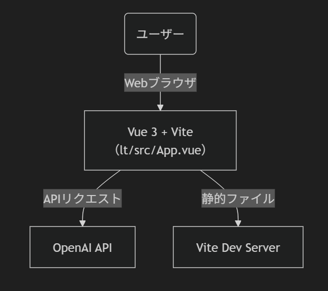
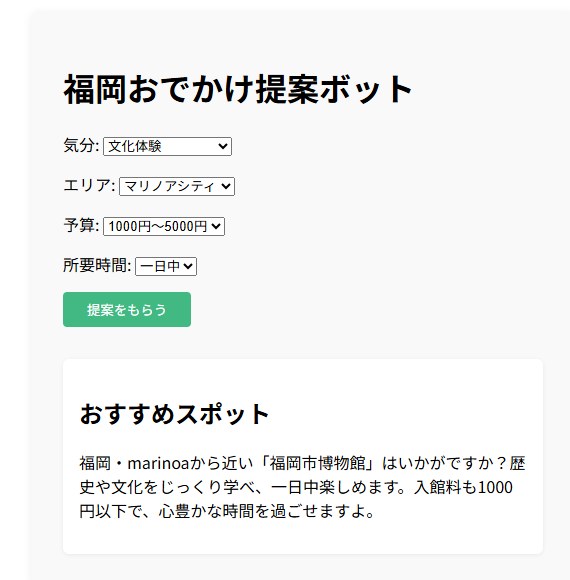

<!-- スライド1：タイトル -->

# AIディグる会

## 1時間でAIサービスを作ってみた

- **名前**：鷲崎 洋平（WASHIZAKI Yohei）  
- **肩書**：ソフトウェアエンジニア / 個人開発者  

---

<!-- スライド2：自己紹介 -->

## 自己紹介

- 📍 2024年から福岡に移住
  - 佐賀→福岡→鹿児島→熊本→大阪→東京→大阪→福岡
- 🎮 ゲーム開発歴10年以上  
- 🛠 使用技術：Unity C# / GitHub Actions / CLIツール開発

---

<!-- スライド3：関心・活動 -->

## 最近の関心ごと

- 🌐 Web API
- 🗺 位置情報ゲーム
- 🧠 生成AI × 地域課題  
- 🎨 趣味：絵を描くこと

---

<!-- スライド4：LT概要 -->

## LT概要

- **テーマ**：福岡おでかけ提案ボット
- **技術スタック**：Vue 3 / Vite / OpenAI API
- **開発時間**：1時間

---

<!-- スライド5：システム構成 -->

## システム構成

---

<!-- スライド6：画面イメージ -->

## 画面イメージ

---

<!-- スライド7：連絡先 -->

## Contact

- 🐙 GitHub: [@yohei-washizaki](https://github.com/yohei-washizaki)

